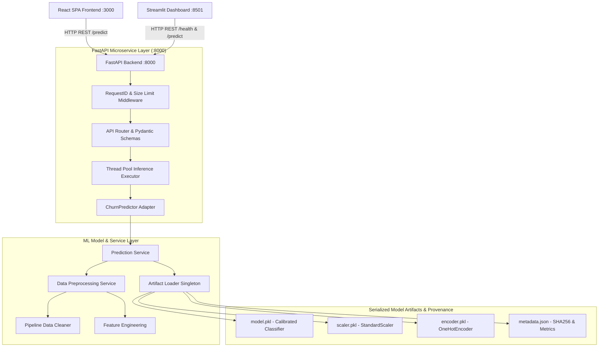

# 📡 Telecom Customer Churn Predictor — Capstone Enterprise ML System

[](https://github.com/abhinavettikala-cloud/persevex__churn_predictor/actions)


Production-grade Machine Learning microservices ecosystem for predicting telecom customer churn risk. Built with **FastAPI**, **Streamlit**, **React (Vite/TypeScript)**, **Scikit-learn**, **XGBoost**, and **Docker Compose**.

---

## 📐 System Architecture



---

## 🚀 Microservice Architecture

The project consists of 3 distinct, decoupled microservices:

| Service | Technology Stack | Default Port | Description |
|---|---|---|---|
| **API Backend** | FastAPI, Uvicorn, Pydantic, Scikit-learn | `http://localhost:8000` | RESTful ML inference API, strict payload validation, telemetry, and health diagnostics |
| **Analytical Dashboard** | Streamlit, Requests, Pandas | `http://localhost:8501` | Executive analytics dashboard with demo profile presets, batch prediction, and health monitoring |
| **React Web App** | React 19, Vite, TypeScript, Tailwind CSS | `http://localhost:3000` | High-performance interactive UI exposing all 19 customer features with auto-retry and real API integration |

---

## 🛠️ Prerequisites & Setup Instructions

### 1. Local Python & Node Setup

```bash
# Clone repository
git clone https://github.com/abhinavettikala-cloud/persevex__churn_predictor.git
cd telecom-churn-predictor

# Create & activate Python virtual environment
python -m venv .venv
# On Windows:
.venv\Scripts\activate
# On Linux/macOS:
source .venv/bin/activate

# Install pinned Python dependencies
pip install -r requirements.txt

# Install Node dependencies for React frontend
npm ci
```

---

## 🏃 Running the Services Locally

### Option A: Run Individual Microservices

```bash
# 1. Start FastAPI Backend Server
python app.py
# (FastAPI is now live at http://localhost:8000 | Interactive Docs at http://localhost:8000/docs)

# 2. Start Streamlit Dashboard (In a second terminal)
streamlit run streamlit_app.py --server.port 8501

# 3. Start React Web App (In a third terminal)
npm run dev
```

### Option B: Run via Docker Compose (Multi-Container Deployment)

```bash
# Build & start all 3 microservices in Docker containers
docker-compose up --build

# Services will be available at:
# - FastAPI API:   http://localhost:8000
# - Streamlit:     http://localhost:8501
# - React SPA:     http://localhost:3000
```

---

## 🧪 Automated Testing & Pipeline Retraining

### Execute Comprehensive Test Suite
```bash
# Run master test runner script (Pipeline, Service Layer, API Endpoints, Edge Cases)
python run_all_tests.py

# Or run pytest directly with verbosity
python -m pytest tests/ -v
```

### Execute ML Pipeline Training & Artifact Generation
```bash
# Retrains models, performs class balancing & probability calibration, exports artifacts & metadata.json
python train_pipeline.py
```

### React Frontend Type Check & Production Build
```bash
# TypeScript strict linting
npm run lint

# Production Vite build
npm run build
```

---

## 📖 API Contract Documentation

### 1. Health Diagnostics — `GET /health`
- **Request**: `GET /health`
- **Response** (HTTP 200 OK):
```json
{
  "status": "healthy",
  "model_loaded": true,
  "scaler_loaded": true,
  "encoder_loaded": true,
  "timestamp": "2026-08-06T12:15:00.000000+00:00"
}
```

### 2. Predict Customer Churn — `POST /predict`
- **Headers**: `Content-Type: application/json`
- **Request Body Example**:
```json
{
  "gender": "Female",
  "SeniorCitizen": 0,
  "Partner": "Yes",
  "Dependents": "No",
  "tenure": 1,
  "PhoneService": "Yes",
  "MultipleLines": "No",
  "InternetService": "Fiber optic",
  "OnlineSecurity": "No",
  "OnlineBackup": "No",
  "DeviceProtection": "No",
  "TechSupport": "No",
  "StreamingTV": "No",
  "StreamingMovies": "No",
  "Contract": "Month-to-month",
  "PaperlessBilling": "Yes",
  "PaymentMethod": "Electronic check",
  "MonthlyCharges": 85.50,
  "TotalCharges": 85.50
}
```
- **Response** (HTTP 200 OK):
```json
{
  "prediction": "Churn",
  "churn_label": 1,
  "probability": 0.8452,
  "confidence_score": 0.8452,
  "risk_level": "High",
  "timestamp": "2026-08-06T12:15:01.123456+00:00"
}
```
- **Validation Rules**:
  - Unrecognized extra fields return `422 Unprocessable Entity` (`extra="forbid"`).
  - Empty or partial JSON payloads return `422 Unprocessable Entity`.
  - Non-finite numbers (`NaN`, `Infinity`) return `422 Unprocessable Entity`.
  - Non-JSON Content-Type headers return `415 Unsupported Media Type`.
  - Request payloads > 1 MB return `413 Payload Too Large`.

### 3. Telemetry & Metrics — `GET /metrics`
- **Response** (HTTP 200 OK):
```json
{
  "telemetry": {
    "total_requests": 142,
    "total_predictions": 120,
    "churn_predictions": 34,
    "no_churn_predictions": 86,
    "validation_errors": 2,
    "internal_errors": 0,
    "total_latency_seconds": 3.421
  },
  "average_latency_seconds": 0.0241,
  "timestamp": "2026-08-06T12:15:02.000000+00:00"
}
```

---

## ⚙️ Environment Variables Reference (`.env.example`)

| Variable Name | Default Value | Description |
|---|---|---|
| `PORT` | `8000` | FastAPI server listening port |
| `LOG_LEVEL` | `INFO` | Python logging severity filter level |
| `ENVIRONMENT` | `production` | Deployment environment flag (`development`, `staging`, `production`) |
| `CORS_ORIGINS` | `http://localhost:3000,http://localhost:3001,http://localhost:8501` | Comma-separated list of trusted CORS origins |
| `MAX_PAYLOAD_SIZE_BYTES` | `1048576` | Maximum allowed request body size in bytes (1 MB) |
| `API_BASE_URL` | `http://localhost:8000` | FastAPI endpoint target URL for Streamlit dashboard |
| `VITE_API_BASE_URL` | `http://localhost:8000` | FastAPI endpoint target URL for React SPA |

---

## 📊 Model Provenance, Metadata & Performance Metrics

### Dataset Overview
- **Source**: Telecommunications Customer Churn Dataset
- **Total Customer Records**: 7,043
- **Class Distribution**: 5,174 Non-Churn (73.5%) vs 1,869 Churn (26.5%)
- **Feature Space**: 19 Raw Customer Features → 55 Transformed Features after One-Hot Encoding and Scaling

### Model Performance Comparison

| Model Algorithm | Accuracy | Precision | Recall | F1 Score | ROC-AUC | PR-AUC |
|---|---|---|---|---|---|---|
| **Logistic Regression (Calibrated)** | **80.34%** | **66.78%** | 51.60% | **0.5822** | **0.8461** | **0.6577** |
| **XGBoost (Calibrated)** | **80.34%** | 64.74% | **56.95%** | 0.6060 | 0.8437 | 0.6548 |
| **Random Forest (Calibrated)** | 79.56% | 63.44% | 54.28% | 0.5850 | 0.8399 | 0.6507 |

### Serialized Artifact Checksums (`metadata.json`)

```json
{
  "model_version": "1.0.0",
  "artifacts": {
    "model_pkl": {"filename": "model.pkl", "sha256": "b29c44f30e0a220a13a0fff3f8c79b071a18343b3105002d1ce43f90c508d7f5"},
    "scaler_pkl": {"filename": "scaler.pkl", "sha256": "fd413e7f268009915ba22cdc2bc4b7ccb25c700d4893afe60fb170738f135e87"},
    "encoder_pkl": {"filename": "encoder.pkl", "sha256": "3f5c382e3a766bd8be381cb30d7c81749cc0571e84de95439c95b38f0fdffc55"}
  }
}
```

---

## 🔒 Security, Compliance & Production Hardening

1. **Non-Root Execution**: Docker containers run under restricted user `appuser`.
2. **Strict CORS Policy**: `allow_credentials` is disabled when wildcard origins are configured; explicit origins are explicitly checked.
3. **Correlation Tracking**: Every request receives a unique `X-Request-ID` UUID header propagated into logs.
4. **Non-Blocking Async Inference**: ML inference runs in a dedicated worker thread pool (`anyio.to_thread.run_sync`), keeping the asyncio loop responsive under heavy load.
5. **No Synthetic Fallbacks**: Client applications surface connection errors explicitly rather than returning fabricated predictions.
